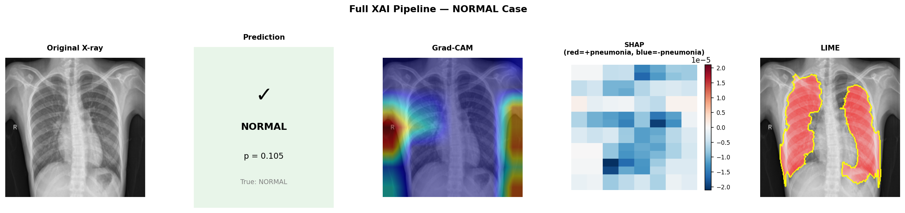
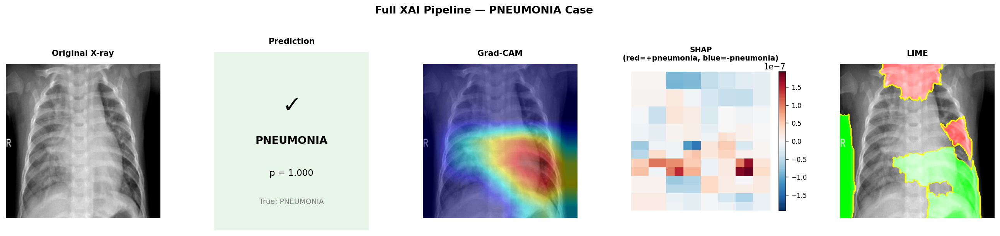

# Transparent Pneumonia Detection using Multi-Method Explainable AI

> **Key Insight:** Disagreement between explainability methods reveals unreliable model reasoning — even when predictions are correct.

---

## What This Project Does

This project builds a chest X-ray pneumonia classifier using ResNet-50 and analyses its decisions using three complementary explainability methods — Grad-CAM, SHAP, and LIME. The core contribution is not the classification itself, but the systematic evaluation of when and why the model's explanations can be trusted. Cross-method agreement is introduced as a practical indicator of trust 
in medical AI systems. This project demonstrates that agreement between explainability methods may be a stronger indicator of model reliability than predictive accuracy alone.

---

## Method

- **Model:** ResNet-50 trained from scratch for binary classification (Normal vs Pneumonia)
- **Explainability:** Grad-CAM + SHAP + LIME applied simultaneously on identical images
- **Framework:** Cross-method agreement analysis as a proxy for trust
- **Failure Analysis:** False negative investigation using all three XAI methods

---

## Results

| Metric | Value |
|--------|-------|
| AUC | 0.9701 |
| PR-AUC | 0.9796 |
| False Negatives Analysed | 3 |
| XAI Methods Compared | 3 |

---

## Demo — Full XAI Pipeline

One X-ray in. Prediction + three explanations out.




---

## How to Run

```bash
1. Clone the repository
   git clone https://github.com/emanaak04-svg/medical-xai.git

2. Open any notebook in Google Colab

3. Connect Google Drive and add your Kaggle API key to Colab secrets

4. Run all cells from top to bottom
```

Notebooks run in order:
- `01` → Data exploration
- `02` → Preprocessing
- `03` → Evaluation metrics
- `04` → Model architecture
- `05` → Training
- `06` → Evaluation
- `07` → Grad-CAM
- `08` → SHAP
- `09` → LIME + XAI comparison
- `10` → Full pipeline demo

---

## Paper

The full research paper is available in the [`paper/`](paper/) folder:

- [Full Paper](paper/Transparent_Medical_XAI_Full_Paper.pdf)
- [Literature Review & Methodology](paper/11_literature_review.pdf)
- [Results, Discussion & Conclusion](paper/12_results_discussion_conclusion.pdf)
- [Abstract & Introduction](paper/13_abstract_introduction.pdf)

---

## Author

**Eman Ayman Ahmed Abukhousa**  
BSc Data Science & Artificial Intelligence, IITG — Year 3
